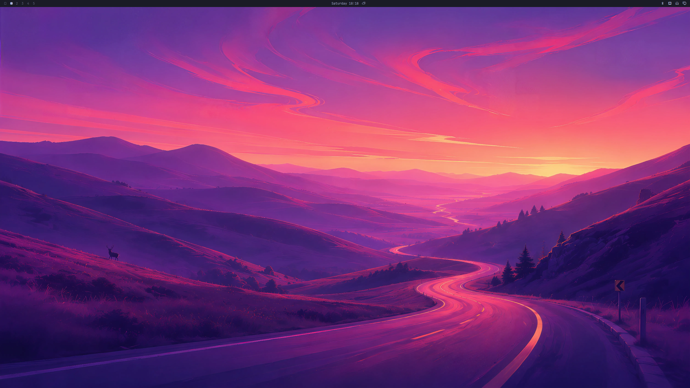

# Omanix



Omanix is a NixOS port of [Omarchy](https://omarchy.org). It brings the same curated, keyboard-driven Hyprland experience to NixOS while embracing the Nix philosophy: everything is declarative, reproducible, and configured at build time.

> [!NOTE]
> Omanix has been upgraded to bring the features of **Omarchy Quattro** to NixOS. The whole desktop now runs on a single [Quickshell](https://quickshell.outfoxxed.me/) shell (bar, launcher, menus, notifications, OSD, lock, wallpaper), with new weather and agent-usage widgets, a gaming module, and theme-colored boot splash.

## What You Get

A complete Hyprland desktop out of the box:

- **Window Management** - Hyprland (driven through its Lua config/IPC API) with sensible defaults, dwindle layout, animations, and blur
- **Desktop Shell** - A single [Quickshell](https://quickshell.outfoxxed.me/) shell hosts the bar, app launcher, nested menus, notifications, on-screen display, lock screen, clipboard, and wallpaper — one unified, fully themed surface
- **Widgets** - Workspaces, active window, media, clock, tray, network/bluetooth/audio/power, plus weather and agent-usage widgets; the bar layout is configurable per section
- **Terminal** - Ghostty with Zsh, Starship prompt, and a curated set of shell tools (eza, ripgrep, fd, fzf, bat, direnv)
- **Editor** - Neovim via LazyVim with per-language support you opt into
- **Idle Management** - A single Quickshell idle owner: a fullscreen screensaver, then lock, each with a configurable timeout
- **Screenshots** - Region/window/fullscreen capture via grim + slurp + Satty editor
- **Screen Recording** - wl-screenrec with VAAPI hardware encoding and optional audio
- **Theming** - Declarative themes that propagate to every component (terminal, shell/bar, lock screen, notifications, browser chrome, btop, bat), with live runtime preview
- **Menu System** - Nested Quickshell menus for style, capture, sharing, system controls, and documentation
- **Gaming & Boot** - Optional gaming module (Battle.net via umu/GE-Proton + RetroArch) and a theme-colored Plymouth boot splash

### Where Omanix Departs from Omarchy

Since NixOS is a fundamentally different paradigm from Arch, some things work differently:

- **Themes are declarative.** Your flake is the source of truth: you set `omanix.theme` and rebuild. You can still live-preview any bundled theme at runtime (the "Change Theme" menu / `omanix-theme-set`), but that's an ephemeral overlay — the next rebuild re-asserts your declared theme.
- **No TUI package installer.** Installing packages imperatively goes against the Nix philosophy. Everything — including shell plugins — is declared in your config and built into the store; nothing is fetched at runtime.
- **Zsh instead of Bash.** Omanix uses Zsh with Oh My Zsh, autosuggestions, and syntax highlighting as the default shell.
- **Everything is a module option.** Apps, languages, visual tweaks, and idle behaviour are all configurable through typed NixOS/Home Manager options.
- **wl-screenrec instead of gpu-screen-recorder.** Omanix records the screen with wl-screenrec (Hyprland's screencopy + VAAPI hardware encoding) for a simpler setup. There is no webcam overlay.

## How It Works (Read This First)

If you're new to NixOS, here's the mental model for using Omanix. It's different from installing an app. Omanix is a set of modules you pull into your own system configuration.

**1. Install NixOS the normal way.**
Install NixOS on your machine using the [official installer](https://nixos.org/download/#nixos-iso). The standard graphical or minimal ISO is fine. Omanix does not have its own installer; it sits on top of a regular NixOS install. Get to a working system that boots first.

**2. Turn your system config into a flake.**
Omanix is distributed as a [Nix flake](https://nixos.wiki/wiki/Flakes), so your system needs to be flake-based too. Create a `flake.nix` for your machine (typically alongside your `hardware-configuration.nix` in `/etc/nixos/`, or in a Git repo you keep somewhere). This flake *is* your system; it's where all of your configuration lives.

**3. Import Omanix into your flake.**
Add Omanix as an input and import its two modules (the NixOS module and the Home Manager module), then enable it:

```nix
# flake.nix inputs
omanix = {
  url = "github:T00fy/omanix";
  inputs.nixpkgs.follows = "nixpkgs";
  inputs.home-manager.follows = "home-manager";
};
```

```nix
# somewhere in your NixOS config
omanix.enable = true;
```

**4. Rebuild.**

```bash
sudo nixos-rebuild switch --flake .
```

That gives you the full Omanix desktop. The complete, copy-pasteable flake (inputs, module imports, Home Manager wiring, and user details) is in the **[Getting Started](https://t00fy.github.io/omanix/getting-started.html)** guide. Start there.

## Customizing: Change *Your* Flake, Not Omanix

Because Omanix lives inside **your** flake, that's also where you customize it. You do **not** fork or clone Omanix to make changes.

- **Want a different theme, wallpaper, or idle behaviour?** Set the relevant `omanix.*` option in your own config. See the [Options Reference](https://t00fy.github.io/omanix/nixos.html).
- **Want extra programs Omanix doesn't ship?** Add them to your own `environment.systemPackages` or `home.packages` in your flake, exactly as you would on any NixOS system. Omanix enabling a Hyprland desktop doesn't stop you from configuring the rest of your machine normally.
- **Want to tweak something Omanix sets up?** Override it in your own config. Your flake always has the final say.

The rule of thumb: **anything specific to you and your machine goes in your flake.**

### When to Contribute Back Instead

If a change you're making isn't just personal, if it's something that could benefit others in a general, reusable way, consider contributing it to Omanix instead of keeping it in your flake. Good candidates:

- A new theme
- Support for an optional app that others would plausibly want
- A bug fix or an improvement to an existing module

In those cases, open a PR (see [Contributing](#contributing)). Keep the personal stuff in your flake; push the reusable stuff upstream.

## Documentation

Full documentation is available at **[t00fy.github.io/omanix](https://t00fy.github.io/omanix/)**.

- [Getting Started](https://t00fy.github.io/omanix/getting-started.html) - add Omanix to your flake
- [Configuration Guide](https://t00fy.github.io/omanix/configuration.html) - common patterns with examples
- [Options Reference](https://t00fy.github.io/omanix/nixos.html) - every `omanix.*` option with types and defaults

## Keybindings

Omanix ships with comprehensive keybindings that closely match Omarchy. Rather than listing them all here, you can:

- Press **Super+K** to open the keybindings viewer from within Omanix
- Press **Super+Space** to open the launcher, or **Super+Escape** for the system menu
- Refer to the [Omarchy Hotkeys Manual](https://learn.omacom.io/2/the-omarchy-manual/53/hotkeys) - the bindings are nearly identical

## Themes

Omanix ships with **Tokyo Night** and **Catppuccin Mocha**. Themes are defined in `lib/themes.nix` (the source of truth for the current set) and contain everything: colour palette, wallpapers, bat syntax theme, and icon theme.

### Adding a Theme

To add a new theme, create a PR that adds an entry to `lib/themes.nix`. Each theme needs:

```nix
{
  my-theme = {
    meta = {
      name = "My Theme";
      slug = "my-theme";
      icon_theme = "Yaru-blue";      # Any icon theme available in nixpkgs
      mode = "dark";                 # "dark" or "light"
    };

    assets.wallpapers = [
      ../assets/wallpapers/my-theme/wallpaper-1.jpg
      ../assets/wallpapers/my-theme/wallpaper-2.jpg
    ];

    bat = {
      name = "theme-name";           # As listed in `bat --list-themes`
      url = "https://raw.githubusercontent.com/.../theme.tmTheme";
      sha256 = "sha256-...";
    };

    colors = {
      background = "#...";
      foreground = "#...";
      accent = "#...";
      cursor = "#...";
      selection_background = "#...";
      selection_foreground = "#...";
      color0 = "#...";  color1 = "#...";  color2 = "#...";  color3 = "#...";
      color4 = "#...";  color5 = "#...";  color6 = "#...";  color7 = "#...";
      color8 = "#...";  color9 = "#...";  color10 = "#..."; color11 = "#...";
      color12 = "#..."; color13 = "#..."; color14 = "#..."; color15 = "#...";
    };
  };
}
```

Place wallpapers in `assets/wallpapers/your-theme/` and include them in the PR.

## Contributing

Contributions are welcome! Some ideas:

- **New themes** - the easiest way to contribute. Follow the schema above and open a PR.
- **New optional apps** - add a module under `modules/home-manager/apps/`. Everything should default to `false` (or use `mkEnableOption`) so users opt in explicitly. The module should integrate with the active theme where appropriate.
- **Bug fixes and improvements** - if you find something that doesn't work or could work better, PRs and issues are appreciated.
- **Documentation** - improvements to the docs under `docs/` are always helpful.

I haven't optimized this for laptops either - because I'm personally not using this on a laptop. Things like battery/power settings are unlikely to be working. PR's addressing this are appreciated
